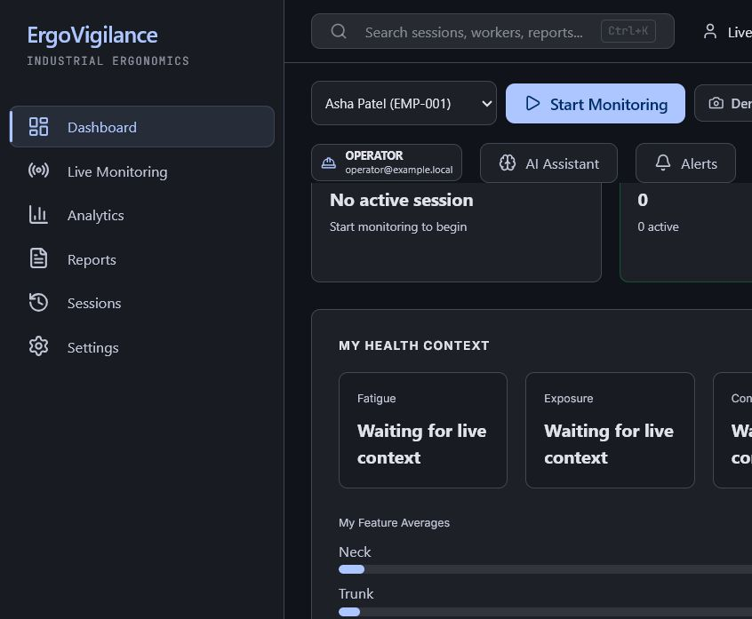

# ErgoVigilance — AI-Powered Industrial Ergonomics Platform

> Real-time posture risk detection, live monitoring, alerts, and reporting for factory floors — powered by computer vision and biomechanical analysis.



## What It Does

ErgoVigilance watches a worker through an ordinary webcam, detects body pose in real time using MediaPipe, converts the skeleton into biomechanical risk scores (RULA/REBA), and gives:

- **Operators** — live posture feedback, plain-language guidance, stretch reminders
- **Supervisors** — worker risk summaries, department heatmaps, trend charts
- **Safety Managers** — alert management, audit trail, PDF safety reports
- **Admins** — system health, user management, camera configuration, deployment monitoring

## Tech Stack

| Layer | Technology |
|---|---|
| **Frontend** | React 19, TypeScript, Vite, Tailwind CSS, Recharts |
| **Backend API** | FastAPI (Python 3.11+), Pydantic, SQLite/PostgreSQL |
| **AI Core** | MediaPipe Pose, YOLOv8 (person detection), YuNet (face), SFace (identity) |
| **ML Models** | HistGradientBoosting (task classification), Risk Forecaster, SVM (legacy) |
| **Deployment** | Docker Compose, Windows Service scripts, `.env`-driven config |

## Quick Start

### Option A: Docker (recommended for demos)

```bash
# Clone and start
git clone https://github.com/rianhussain007/Ergovigilance-.git
cd Ergovigilance-
docker compose up -d --build

# Open
# Frontend: http://localhost:8080
# API docs: http://localhost:8000/docs
# Login: admin@example.local / AdminPass123!
```

### Option B: Local Development

```bash
# Backend
cd backend_api
python -m venv venv
venv\Scripts\activate          # Windows
pip install -r requirements.txt
uvicorn app.main:app --reload  # API on :8000

# Frontend
cd ui_posture
npm install
npm run dev                    # Vite on :5173
```

### Option C: Demo Mode (no camera needed)

```bash
# Starts with synthetic data pre-loaded — perfect for customer presentations
DEMO_MODE=true docker compose up -d
# Or locally: set DEMO_MODE=true in your .env
```

## Key Features

### Live Monitoring
- Real-time pose estimation at 30 FPS
- 12 biomechanical features (neck, trunk, shoulders, knees, wrists, stance)
- RULA/REBA standard-method risk scoring
- Temporal hysteresis (level dwell) to prevent alert flickering
- Task classification (Assembly, Lifting, Inspection, Reaching, etc.)
- AI-powered plain-language explanations (Ollama integration)

### Worker Identity & Consent
- Badge/QR code identity assignment
- Face recognition for automatic worker identification
- Consent-first architecture — no face matching without explicit consent
- Worker onboarding flow with intake tracker

### Alerts & Recommendations
- Automatic alert firing on sustained risk posture
- Acknowledge/resolve lifecycle with audit trail
- Context-aware recommendations (worker + supervisor guidance)
- Alert toast notifications in the UI

### Reporting & Analytics
- Session history with calendar view
- Risk trend charts (per-worker, per-department)
- Safety report PDF export (Playwright-rendered)
- Session replay with recorded video
- Benchmark percentiles (de-identified)

### Video Review
- Upload and analyze recorded videos
- Frame-by-frame pose analysis with temporal smoothing
- Keypoint interpolation for smooth skeleton overlay
- Risk timeline with region-level breakdown

### Multi-Camera Support
- USB webcam auto-detection (DSHOW backend)
- IP/RTSP camera configuration
- Multi-Camera dashboard view
- Camera setup wizard (framing, lighting, face checks)

### Deployment & Operations
- Docker Compose with `.env`-driven ports
- Windows Service scripts (`deploy/`)
- Health probes (`/healthz`, `/readyz`, `/metrics`)
- Data retention policy (session age, recording age, disk cap)
- Crash-safe session recovery from checkpoints

## API Surface

70+ REST endpoints across 33 modules:

| Module | Endpoints | Description |
|---|---|---|
| Auth | login, register, refresh, me | JWT authentication |
| Dashboard | /dashboard, /supervisor-summary, /admin-summary | Role-gated dashboards |
| Sessions | list, detail, stop, delete | Session lifecycle |
| Alerts | list, resolve, acknowledge | Alert management |
| Reports | safety-report, risk-trend, session-report, PDF export | Report generation |
| Video | analyze, status, download, recording-analysis | Video analysis pipeline |
| Workers | CRUD, face samples, identity | Worker management |
| Cameras | detect, configure | Camera management |
| Settings | GET/PUT | System configuration |
| Deployment | status, metrics | Infrastructure health |
| Assistant | chat, corpus | AI assistant (Ollama) |

Full API docs at `/docs` (Swagger UI) or `/openapi.json`.

## Project Structure

```
posture_analysis/
├── backend/                    # AI core engines
│   ├── context/                #   Context Intelligence Engine
│   ├── services/               #   Pose, features, risk, alerts, tasks
│   └── core/                   #   Constants, types
├── backend_api/                # FastAPI application
│   ├── app/
│   │   ├── api/                #   33 endpoint modules
│   │   ├── core/               #   Auth, config, database, health
│   │   ├── repositories/       #   Data access (Live, Base)
│   │   ├── schemas/            #   Pydantic models (API contracts)
│   │   └── services/           #   Session cache, live monitor, reports
│   └── tests/                  #   233+ pytest tests
├── ui_posture/                 # React 19 SPA
│   ├── src/
│   │   ├── pages/              #   19 route pages (lazy-loaded)
│   │   ├── components/         #   Shared UI components
│   │   ├── hooks/              #   Data-fetching hooks
│   │   ├── services/           #   API client
│   │   └── auth/               #   Auth context + providers
│   └── vitest.config.ts        #   5 smoke tests
├── models/                     # ML model files
├── scripts/                    # Training, labeling, evaluation
├── docs/                       # Architecture, guides, runbooks
├── deploy/                     # Windows service scripts
├── outputs/                    # Sessions, recordings, reports
└── docker-compose.yml          # Production deployment
```

## Configuration

All configuration via environment variables (`.env` file or Docker env):

| Variable | Default | Description |
|---|---|---|
| `DEMO_MODE` | `false` | Seed synthetic data for presentations |
| `SESSIONS_DIR` | `outputs/sessions` | Where session JSON files are stored |
| `POSE_MODEL_PATH` | `models/pose_landmarker_lite.task` | MediaPipe pose model |
| `AUTH_JWT_SECRET` | (dev default) | JWT signing secret — **change in production** |
| `CAMERA_SOURCES` | `[]` | JSON array of IP/RTSP cameras |
| `DATABASE_URL` | `""` | PostgreSQL URL (optional, falls back to SQLite) |
| `RECORDINGS_MAX_GB` | `20` | Disk cap for video recordings |
| `OLLAMA_HOST` | `http://localhost:11434` | Ollama server for AI assistant |

See `backend_api/.env.production.example` for the full reference.

## Testing

```bash
# Backend (233 tests)
cd backend_api && pytest -q

# Frontend (5 smoke tests)
cd ui_posture && npm test

# Typecheck
cd ui_posture && npx tsc --noEmit

# Production build
cd ui_posture && npm run build
```

## Model Accuracy

The task classifier (HistGradientBoosting) achieves **76.9%** held-out accuracy on the internal test split. This measures self-consistency with the rule-based risk thresholds — **not** real-world accuracy against human-labeled ground truth. Zero human ground-truth labels exist; labeling is pending (see `docs/DATA_COLLECTION_GUIDE.md`).

The old 97.97% figure (circular, from auto-generated labels) has been removed from all user-facing surfaces.

## Deployment

### Docker (one command)
```bash
docker compose up -d --build
```

### Windows Service
```powershell
deploy\install_service.ps1    # Install as Windows service
deploy\start.bat              # Or start manually
```

### Environment Setup
1. Copy `backend_api/.env.production.example` to `.env`
2. Set `AUTH_JWT_SECRET` to a strong random string
3. Set `CAMERA_SOURCES` if using IP cameras
4. Set `DEMO_MODE=true` for presentations without a camera

## Documentation

| Document | Description |
|---|---|
| [System Architecture](docs/SYSTEM_ARCHITECTURE_PRESENTATION.md) | Full architecture, wireframes, presentation guide |
| [Delivery Checklist](docs/DELIVERY_CHECKLIST.md) | Factory pilot readiness tracker |
| [Data Collection Guide](docs/DATA_COLLECTION_GUIDE.md) | Ground-truth labeling workflow |
| [Pilot Guide](docs/PILOT_GUIDE.md) | On-site deployment instructions |
| [Ops Runbook](docs/OPS_RUNBOOK.md) | Operations and troubleshooting |
| [Current State](docs/CURRENT_STATE.md) | Feature inventory and model details |

## License

Internal use — GGS Internship Project.
