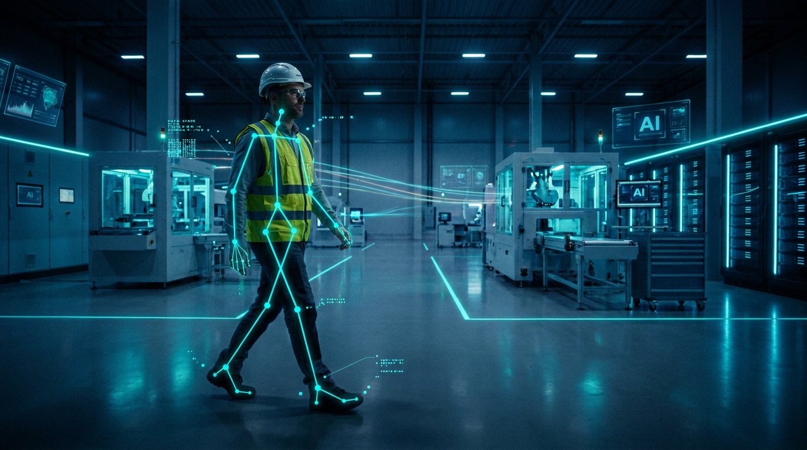
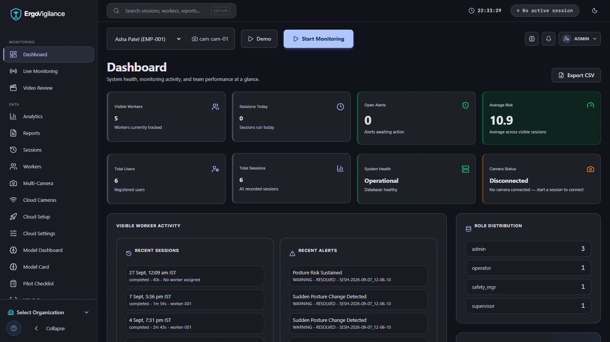
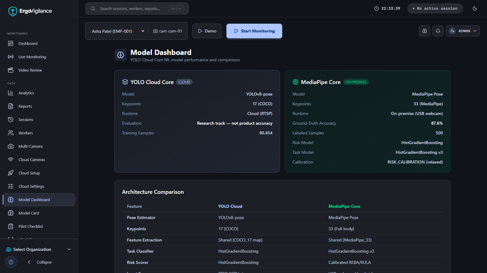
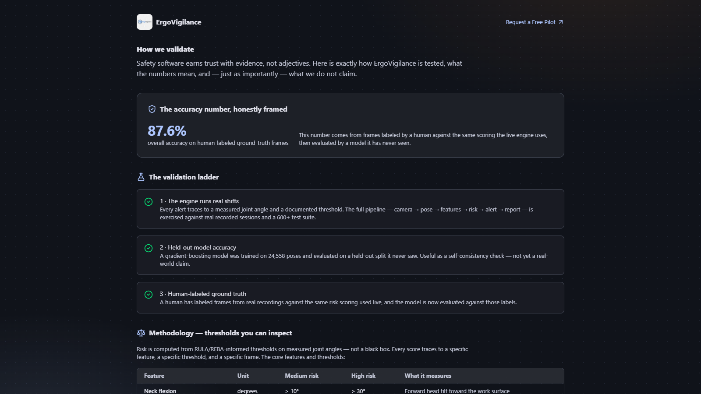
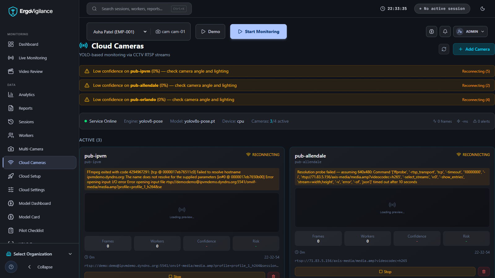

# ErgoVigilance — AI-Powered Industrial Ergonomics Platform

> Real-time posture risk detection, live monitoring, alerts, and reporting for factory floors — powered by computer vision and biomechanical analysis.

<p align="center">
  
  <br/>
  <em>Screening aid, not a medical device — 87.6% agreement with human assessors (LOW/MEDIUM, 500 frames)</em>
</p>

<p align="center">
  <a href="https://github.com/rianhussain007/Ergovigilance-/actions/workflows/ci.yml"></a>
  
  
  
  
</p>

## See it

| Dashboard — live risk, alerts, team | Model Dashboard — honest model comparison |
|---|---|
|  |  |

| Validation — evidence, not adjectives | Cloud monitoring — honest empty states |
|---|---|
|  |  |

*Screenshots captured from the running app (2026-09-27). No mockups — every pixel above is real product, including the honest "no cameras" and "research track" states.*

## What It Does

ErgoVigilance watches a worker through an ordinary webcam, detects body pose in real time using MediaPipe, converts the skeleton into biomechanical risk scores (RULA/REBA), and gives:

- **Operators** — live posture feedback, plain-language guidance, stretch reminders
- **Supervisors** — worker risk summaries, department heatmaps, trend charts
- **Safety Managers** — alert management, audit trail, PDF safety reports
- **Admins** — system health, user management, camera configuration, deployment monitoring

## What It Does NOT Claim

- Not a medical device. Thresholds are heuristic, RULA/REBA-informed — not clinically validated.
- Only customer-safe accuracy: **87.6% on 500 human frames, LOW/MEDIUM only** (no HIGH validated).
- Never quoted: 94.1% / 97.6% / 88.6% / 86.4% / 76.9% (research vintages, retired from headlines).
- Full methodology on the Validation page (`/validation`) and in `results/ground_truth_evaluation.json`.

## Tech Stack

| Layer | Technology |
|---|---|
| **Frontend** | React 19, TypeScript, Vite, Tailwind CSS, Recharts (40 routes) |
| **Backend API** | FastAPI (Python 3.13), Pydantic, SQLite/PostgreSQL (110+ endpoints) |
| **AI Core (On-Premise)** | MediaPipe Pose (33 keypoints), YOLOv8 (person detection), YuNet (face), SFace (identity) |
| **AI Core (Cloud)** | YOLOv8-pose (17 keypoints COCO), ByteTrack (worker tracking), RTSP stream ingestion (~40 endpoints) |
| **ML Models** | HistGradientBoosting (task + risk classification, 7 task classes — see Model Accuracy below) |
| **Deployment** | Docker Compose (4 services), `.env`-driven config |

## Quick Start

### Option A: Docker (recommended for demos)

```bash
git clone https://github.com/rianhussain007/Ergovigilance-.git
cd Ergovigilance-
# AUTH_JWT_SECRET is REQUIRED — the stack refuses to boot without it (fail-closed)
$env:AUTH_JWT_SECRET = python -c "import secrets; print(secrets.token_urlsafe(48))"
docker compose up -d --build

# Frontend: http://localhost:8080
# API docs:  http://localhost:8000/docs
# Login:     admin@example.local / AdminPass123!
```

### Option B: Local Development (3 processes — see `docs/DEV_START.md`)

```powershell
# Terminal 1 — backend :8000
$env:AUTH_JWT_SECRET = python -c "import secrets; print(secrets.token_urlsafe(48))"
$env:DEBUG = "true"
cd backend_api; uvicorn app.main:app

# Terminal 2 — cloud core :8100
$env:DEBUG = "true"
python -m uvicorn yolo_cloud.api:create_app --factory --host 127.0.0.1 --port 8100

# Terminal 3 — frontend :3000
cd ui_posture; npm install; npm run dev
```

### Option C: Demo Mode (no camera needed)

```powershell
# Topbar Demo replays a video file through the live pipeline.
# Cut a local sample (footage is never committed):
ffmpeg -y -ss 30 -i <recording>.mp4 -t 30 -vf scale=1280:-2 demo-assets/demo.mp4
$env:DEMO_VIDEO_PATH = "$PWD\demo-assets\demo.mp4"
```

## Key Features

### Live Monitoring
- Real-time pose estimation (rate depends on hardware — see Sizing)
- 12 biomechanical features (neck, trunk, shoulders, knees, wrists, stance)
- RULA/REBA standard-method risk scoring
- Temporal hysteresis (level dwell) to prevent alert flickering
- Task classification (Assembly, Lifting, Inspection, Reaching, etc.)
- AI-powered plain-language explanations (Ollama integration)

### Worker Identity & Consent
- Badge/QR code identity assignment
- Face recognition for automatic worker identification
- Consent-first architecture — no face matching without explicit consent
- Tenant-scoped consent records (cross-org access returns 404)
- Worker onboarding flow with intake tracker

### Alerts & Recommendations
- Automatic alert firing on sustained risk posture
- Acknowledge/resolve lifecycle with audit trail
- Context-aware recommendations (worker + supervisor guidance)
- Alert toast notifications in the UI

### Reporting & Analytics
- Session history with calendar view
- Risk trend charts (per-worker, per-department)
- Safety report PDF export (Playwright-rendered, in-container verified)
- Session replay with recorded video
- Benchmark percentiles (de-identified)

### Video Review
- Upload and analyze recorded videos
- Frame-by-frame pose analysis with temporal smoothing
- Keypoint interpolation for smooth skeleton overlay
- Risk timeline with region-level breakdown

### Multi-Camera Support
- USB webcam auto-detection
- IP/RTSP camera configuration with honest connectivity probing
- Multi-Camera dashboard view with stream-scoped auth tokens
- Camera setup wizard (framing, lighting, face checks)

### YOLO Cloud Core (SaaS)
- RTSP CCTV stream ingestion via FFmpeg (bounded connects, orphan-safe)
- YOLOv8-pose inference (17 COCO keypoints)
- ByteTrack worker tracking across frames
- ML-trained risk/task classifiers (research track — see Model Accuracy)
- Real-time WebSocket camera data streaming
- PDF/CSV report generation (daily/weekly)
- Model versioning with export/import/rollback
- Persisted inference settings (restart-applied) + disk-space guard
- Docker GPU support (NVIDIA CUDA)

### Dual-Core Architecture
- **On-Premise Core**: MediaPipe (33 keypoints), USB webcam, gateway PC required
- **Cloud Core**: YOLOv8-pose (17 keypoints), RTSP CCTV, zero on-site hardware
- Same dashboard, same reports, same alerts
- Choose based on factory needs: privacy-first vs. easy installation

### Pages (40 routes)
- YOLO Demo — Upload image → see pose + risk overlay
- Model Dashboard — YOLO vs MediaPipe comparison + versioning
- ROI Analytics — Cost savings, compliance scores, business case
- System Health — Service status, storage, live metrics
- Onboarding — Factory setup checklist (honest, no fabricated results)
- Cloud Cameras — Camera management with health monitoring
- Cloud Settings — YOLO model config + RTSP connection tester (persisted)
- Pricing — 3-tier pricing (Starter/Cloud/Enterprise)

### Deployment & Operations
- Docker Compose with `.env`-driven ports (4 services)
- Health probes (`/healthz`, `/readyz`); stats endpoints (`/metrics`, `/sla`, ...) gated by `METRICS_TOKEN`
- Unified retention policy (sessions, recordings GB cap, audit logs, alert rows, Postgres telemetry)
- AES-256 backup encryption + hermetic restore drill (RTO measured)
- Crash-safe session recovery from checkpoints
- CSP security headers, rate limiting, non-root Docker, read-only root filesystems (k8s)

## API Surface

150+ REST endpoints across 40+ modules + WebSocket streams:

### Backend API (110+ endpoints)
| Module | Endpoints | Description |
|---|---|---|
| Auth | login, register, refresh, me, MFA | JWT authentication, TOTP second factor |
| Dashboard | /dashboard, /supervisor-summary, /admin-summary | Role-gated dashboards |
| Sessions | list, detail, stop, delete, start | Session lifecycle |
| Alerts | list, resolve, acknowledge | Alert management |
| Reports | safety-report, risk-trend, session-report, PDF export | Report generation |
| Video | analyze, status, download, stream-token, recording-analysis | Video pipeline + scoped stream auth |
| Workers | CRUD, face samples, identity | Worker management |
| Users | CRUD, invite, roles | User management |
| Cameras | detect, configure | Camera management |
| Consent | list, grant, deny, withdraw (org-scoped) | GDPR/CCPA consent |
| Organizations | list, current, plan provisioning | Multi-tenant orgs + entitlements |
| Billing | checkout, subscription, portal, webhook | Stripe (14-day trial, coupons) |
| Settings | GET/PUT | System configuration |
| Deployment | status, metrics | Infrastructure health |
| Assistant | chat, corpus | AI assistant (Ollama) |

### YOLO Cloud Core (~40 endpoints)
| Module | Endpoints | Description |
|---|---|---|
| Camera | CRUD, start, stop, **probe** | RTSP management + honest connectivity test |
| Settings | GET, POST | Persisted inference knobs (restart-applied) |
| Dashboard | /dashboard, /alerts | Cloud monitoring dashboard |
| Sessions | list, detail | Cloud session management |
| Alerts | list, acknowledge | Cloud alert management |
| Reports | daily, weekly, PDF, CSV | Report generation |
| Models | metrics, compare, versions, save, rollback, export, import | Model management |
| Inference | /detect | Real-time pose detection |
| WebSocket | /ws | Live camera data streaming |

Full API docs at `/docs` (Swagger UI) or `/openapi.json`.

## Project Structure

```
posture_analysis/
├── backend/                    # AI core engines (on-premise)
│   ├── context/                #   Context Intelligence Engine
│   ├── services/               #   Pose, features, risk, alerts, tasks, assessment pack
│   └── core/                   #   Constants, types
├── backend_api/                # FastAPI application (on-premise)
│   ├── app/
│   │   ├── api/                #   40+ endpoint modules
│   │   ├── core/               #   Auth, config, database, health
│   │   ├── repositories/       #   Data access (Live, Base)
│   │   ├── schemas/            #   Pydantic models (API contracts)
│   │   └── services/           #   Session cache, live monitor, reports
│   └── tests/                  #   65 test files (478 tests)
├── yolo_cloud/                 # YOLO Cloud Core (SaaS)
│   ├── api.py                  #   ~40 REST + WebSocket endpoints
│   ├── pose_engine.py          #   YOLOv8-pose + ByteTrack + ML inference
│   ├── ingestion.py            #   Multi-camera orchestrator
│   ├── rtsp_manager.py         #   RTSP stream manager (FFmpeg, bounded)
│   ├── model_registry.py       #   Model versioning, export/import
│   ├── reports.py              #   PDF/CSV report generation
│   ├── disk_guard.py           #   Free-space low-watermark guard
│   ├── training/               #   10 training scripts
│   ├── Dockerfile              #   GPU + CPU support
│   └── tests/                  #   170 tests (all passing)
├── ui_posture/                 # React 19 SPA (40 routes)
│   ├── src/
│   │   ├── pages/              #   Route pages (lazy-loaded)
│   │   ├── components/         #   Shared UI components
│   │   ├── hooks/              #   Data-fetching hooks (incl. stream tokens)
│   │   ├── services/           #   API client
│   │   └── auth/               #   Auth context + providers + route guards
│   └── src/test/               #   106 vitest tests
├── models/                     # ML model files
│   ├── yolo_risk_model.pkl     #   Risk classifier (YOLO holdout, REBA-derived — not product accuracy)
│   ├── yolo_task_model.pkl     #   Task classifier (YOLO holdout — not product accuracy)
│   ├── best_model.pkl          #   MediaPipe risk model
│   └── task_model_v3.pkl       #   MediaPipe task model
├── scripts/                    # Training, labeling, evaluation + pilot metrics collector
├── docs/                       # Deployment, pilot guides, audit evidence, runbooks
├── deploy/                     # Compose overlays, k8s manifests, backup/restore/drill scripts
├── outputs/                    # Sessions, recordings, reports (gitignored runtime data)
└── docker-compose.yml          # 4 services (db, backend, frontend, cloud-core)
```

## Configuration

All configuration via environment variables (compose env or shell — no `.env` auto-loading):

| Variable | Default | Description |
|---|---|---|
| `AUTH_JWT_SECRET` | *(required)* | JWT signing secret, ≥32 chars — **boot refuses without it when `DEBUG=false`** |
| `DEBUG` | `false` | `true` = dev mode (ephemeral JWT, open metrics) |
| `METRICS_TOKEN` | `""` | Bearer for `/metrics`, `/sla`, … (else DEBUG-only) |
| `DEMO_VIDEO_PATH` | `""` | Sample clip for topbar Demo mode |
| `SESSIONS_DIR` | `outputs/sessions` | Where session JSON files are stored |
| `DATABASE_URL` | `""` | PostgreSQL URL (optional — boot-safe fallback to SQLite) |
| `RECORDINGS_MAX_GB` | `20` | Disk cap for video recordings |
| `CAMERA_SOURCES` | `[]` | JSON array of IP/RTSP cameras |
| `OLLAMA_HOST` | `http://localhost:11434` | Ollama server for AI assistant |
| `STRIPE_SECRET_KEY` | `""` | Billing disabled without it (graceful `/request-pilot` fallback) |

See `backend_api/.env.production.example` for the full reference.

## Testing

```bash
# Backend (478 tests)
cd backend_api && pytest -q

# Cloud core (170 tests)
python -m pytest yolo_cloud/tests -q

# Frontend (106 vitest) + typecheck + build
cd ui_posture && npx vitest run && npx tsc --noEmit && npm run build
```

## Model Accuracy

**Ground-truth accuracy: 87.6%** — evaluated against 500 human-labeled frames from real session recordings. Every score traces to a measured joint angle and a documented RULA/REBA-informed threshold.

- **Risk scoring**: Rule-based RULA/REBA-informed thresholds on 12 biomechanical features (not a black box)
- **Task classifier**: HistGradientBoosting, 76.9% self-consistency on held-out split (training labels are auto-generated)
- **Risk calibration**: HistGradientBoosting → REBA band, 91.8% holdout agreement (calibration advisory, not product accuracy)

The Validation Page (`/validation`) presents these numbers honestly to customers, including what we do and don't claim. See `results/ground_truth_evaluation.json` for the full evaluation.

The old 97.97% figure (circular, from auto-generated labels) has been removed from all user-facing surfaces.

## Deployment

### Docker (one command)
```bash
docker compose up -d --build
```

### Environment Setup
1. Set `AUTH_JWT_SECRET` to a strong random string (required — see Quick Start)
2. Set `CAMERA_SOURCES` if using IP cameras
3. Point a browser at the frontend; sign up for a pilot org (4 cameras)

## Documentation

| Document | Description |
|---|---|
| [System Architecture](docs/SYSTEM_ARCHITECTURE_PRESENTATION.md) | Full architecture, wireframes, presentation guide |
| [Delivery Checklist](docs/DELIVERY_CHECKLIST.md) | Factory pilot readiness tracker |
| [Data Collection Guide](docs/DATA_COLLECTION_GUIDE.md) | Ground-truth labeling workflow |
| [Pilot Guide](docs/PILOT_GUIDE.md) | On-site deployment instructions |
| [Ops Runbook](docs/OPS_RUNBOOK.md) | Operations and troubleshooting |
| [Current State](docs/CURRENT_STATE.md) | Feature inventory and model details |
| [TRL-8/9 Qualification Plan](docs/TRL8_9_QUALIFICATION_PLAN.md) | Path to production readiness |
| [Sell-Readiness Audit](docs/SELL_READINESS_AUDIT.md) | Pricing↔code truth, claims sweep |

## License

© Rian Hussain. ErgoVigilance is a product by Rian Hussain.
